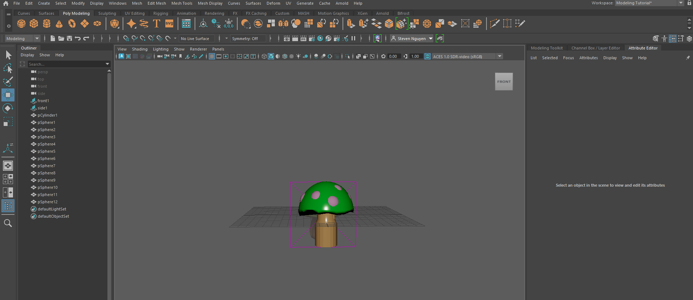

#  Teemo Mushroom 3D Model

A basic low-poly stylized game prop modeled in Autodesk Maya, inspired by Teemo's mushroom from *League of Legends*.

---

##  Modeling Workflow

* **Mushroom Cap:** 
  * Started with a primitive polygon sphere.
  * Selected the edge loop along the equator and cut/deleted the bottom half to create a clean dome shape.
* **Stem:** 
  * Created a polygon cylinder for the base.
  * Applied `Extrude` to taper the mesh and make it pointier toward the top where it connects to the cap.
* **UVs:** 
  * Performed basic UV unwrapping to prepare the mesh for texturing.

---

##  Project Info

* **Software:** Autodesk Maya
* **Asset Type:** Low-Poly Stylized Game Prop
* **Status:** Modeling & Basic UVs Complete
